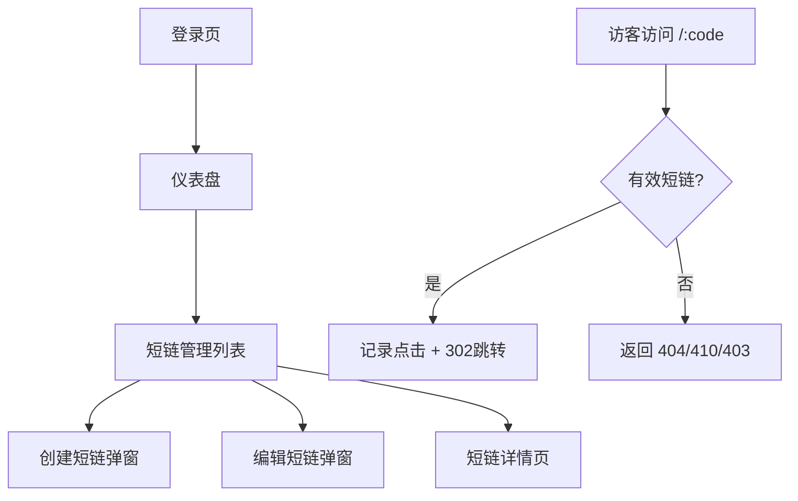

# 短链接管理后台 — 产品需求文档（PRD）

## 1. 产品概述

短链接管理后台是一个本地可运行的全栈 Web 应用，面向运营/技术管理员，用于生成、管理短链接，并提供访问跳转与点击数据分析能力。系统通过 Docker Compose 一键拉起前端、后端、数据库三件套，支持端口环境变量化配置。

- 核心价值：让用户在本地快速拥有一个具备登录鉴权、链接管理、跳转、统计分析能力的短链平台。
- 目标用户：技术运营、个人开发者、企业内部小团队。

## 2. 核心功能

### 2.1 用户角色

| 角色 | 注册方式 | 核心权限 |
| --- | --- | --- |
| 管理员（admin） | 系统初始化时通过环境变量/种子脚本写入默认账号 | 登录后可管理所有短链接、查看仪表盘、查看明细统计 |
| 访客（匿名） | 无需注册 | 仅可通过短码访问跳转 |

### 2.2 功能模块

短链接管理后台包含以下页面：

1. **登录页**：管理员账号密码登录、登录态校验。
2. **仪表盘页**：核心统计指标、Top 短链排行、近期点击趋势。
3. **短链管理页**：分页列表、搜索、创建、编辑、启停、删除。
4. **短链详情页**：单条短链的总点击、按天趋势、最近访问明细。
5. **跳转入口**（无 UI）：`GET /:code` 访问短码自动 302 跳转。

### 2.3 页面功能详情

| 页面 | 模块 | 功能描述 |
| --- | --- | --- |
| 登录页 | 登录表单 | 输入用户名、密码；调用登录接口；成功后保存 JWT 并跳转后台；失败提示错误。 |
| 登录页 | 鉴权拦截 | 未登录访问后台路由时重定向到登录页；token 失效自动登出。 |
| 仪表盘页 | 统计卡片 | 显示短链总数、总点击数、今日点击数、活跃短链数。 |
| 仪表盘页 | Top 排行 | 列出点击数最高的前 N（默认 10）个短链。 |
| 仪表盘页 | 近期趋势 | 折线图展示近 7/30 天每日点击次数。 |
| 短链管理页 | 列表展示 | 分页表格，列：短码、长链接、状态、点击数/上限、过期时间、备注、创建时间、操作。 |
| 短链管理页 | 搜索过滤 | 按短码、目标 URL、备注关键字、状态过滤。 |
| 短链管理页 | 创建短链 | 弹窗表单：目标 URL（必填）、自定义短码（可选；为空则自动生成）、过期时间（可选）、最大点击数（可选）、备注（可选）。 |
| 短链管理页 | 编辑短链 | 修改长链接、过期时间、最大点击数、备注（短码不可改）。 |
| 短链管理页 | 启用/停用 | 一键切换状态；停用后跳转返回 410。 |
| 短链管理页 | 删除短链 | 二次确认后删除（同时删除其点击日志）。 |
| 短链详情页 | 基础信息 | 完整字段、当前状态、剩余可点击次数。 |
| 短链详情页 | 点击趋势 | 按天聚合点击折线图。 |
| 短链详情页 | 访问明细 | 时间、Referer、User-Agent、IP（可选）。 |
| 跳转入口 | 短码访问 | 命中时记录访问日志并 302；过期/停用/达到上限/未找到时返回相应状态码。 |

## 3. 核心业务流程

### 3.1 管理员管理流程
管理员打开站点 → 登录页输入默认账号密码 → 进入仪表盘查看总览 → 进入短链管理创建/编辑/停用/删除短链 → 必要时查看单条详情与点击数据。

### 3.2 短码访问流程
访客访问 `https://站点/:code` → 后端查找短码 → 校验启停状态、过期时间、点击上限 → 通过则记录一条访问日志 + 302 到目标 URL；失败则返回 404/410/403。

## 4. 界面设计

### 4.1 设计风格

- 视觉基调：Ant Design 默认主题，简洁清爽、信息密度适中。
- 主色：`#1677ff`（Ant Design Primary Blue）。
- 字体：系统默认 + Ant Design 默认字号（14px）。
- 布局：侧边导航（Logo + 菜单：仪表盘 / 短链管理 / 退出登录）+ 顶部用户区 + 主内容区。
- 组件：Table、Form、Modal、Statistic、Card、Tag、Switch、DatePicker、Input.Search、Charts（@ant-design/charts）。

### 4.2 关键页面元素

| 页面 | 关键 UI |
| --- | --- |
| 登录页 | 居中卡片，包含 Logo、用户名/密码输入、登录按钮 |
| 仪表盘 | 4 个 Statistic 卡片 + Top 排行表格 + 折线图 |
| 短链管理 | 顶部 SearchBar + 新建按钮；中部 Table；尾部分页器 |
| 短链详情 | 描述列表 Descriptions + 折线图 Line + 访问明细 Table |

### 4.3 响应式
桌面端优先（≥1280px），移动端做基础适配（侧边栏可折叠）。
