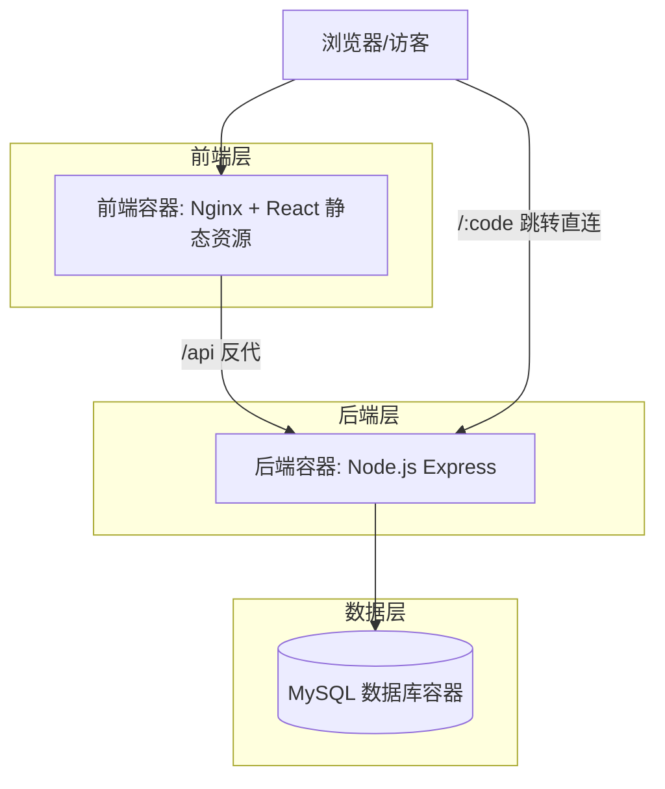

# 短链接管理后台 — 技术架构文档

## 1. 架构总览

本系统采用前后端分离 + 单数据库三层架构，全部通过 Docker Compose 编排到本地，端口由环境变量配置。



## 2. 技术栈

- **前端**：React 18 + Vite + TypeScript + Ant Design 5 + @ant-design/charts + axios + react-router-dom + zustand（轻量状态）
- **后端**：Node.js 20 + Express 4 + Prisma ORM + jsonwebtoken + bcryptjs + nanoid + dayjs + zod（参数校验）
- **数据库**：MySQL 8（持久化卷）
- **打包/部署**：Docker（前端镜像基于 nginx:alpine，后端基于 node:20-alpine）+ Docker Compose
- **反向代理**：前端 Nginx 容器内反代 `/api` 与 `/r/:code` 跳转到后端服务

## 3. 路由定义

### 3.1 前端路由

| 路径 | 用途 | 鉴权 |
| --- | --- | --- |
| `/login` | 登录页 | 否 |
| `/` | 仪表盘 | 是 |
| `/links` | 短链管理列表 | 是 |
| `/links/:id` | 短链详情 | 是 |

### 3.2 后端路由

后端统一前缀 `/api`，跳转入口在 `/r/:code`（避免与前端路由冲突）。

| 方法 | 路径 | 描述 | 鉴权 |
| --- | --- | --- | --- |
| POST | `/api/auth/login` | 登录获取 JWT | 否 |
| GET | `/api/auth/me` | 当前用户信息 | 是 |
| GET | `/api/links` | 分页查询短链（支持 keyword / status） | 是 |
| POST | `/api/links` | 创建短链 | 是 |
| GET | `/api/links/:id` | 获取短链详情（含按天趋势） | 是 |
| PUT | `/api/links/:id` | 编辑短链 | 是 |
| PATCH | `/api/links/:id/status` | 启用/停用 | 是 |
| DELETE | `/api/links/:id` | 删除短链 | 是 |
| GET | `/api/stats/overview` | 仪表盘汇总（总数/总点击/今日/活跃） | 是 |
| GET | `/api/stats/top` | 点击 Top N 短链 | 是 |
| GET | `/api/stats/trend` | 全站近 N 天点击趋势 | 是 |
| GET | `/r/:code` | 短码 302 跳转，失败返回 404/410/403 | 否 |

## 4. 数据模型

```mermaid
erDiagram
    USER ||--o{ SHORT_LINK : creates
    SHORT_LINK ||--o{ CLICK_LOG : has

    USER {
        int id PK
        string username
        string password_hash
        datetime created_at
    }
    SHORT_LINK {
        int id PK
        string code UNIQUE
        string target_url
        boolean enabled
        datetime expires_at
        int max_clicks
        int click_count
        string remark
        int user_id FK
        datetime created_at
        datetime updated_at
    }
    CLICK_LOG {
        int id PK
        int link_id FK
        datetime created_at
        string referer
        string user_agent
        string ip
    }
```

### 4.1 表结构（Prisma schema 摘要）

```prisma
model User {
  id           Int      @id @default(autoincrement())
  username     String   @unique
  passwordHash String
  createdAt    DateTime @default(now())
  links        ShortLink[]
}

model ShortLink {
  id         Int       @id @default(autoincrement())
  code       String    @unique
  targetUrl  String    @db.Text
  enabled    Boolean   @default(true)
  expiresAt  DateTime?
  maxClicks  Int?
  clickCount Int       @default(0)
  remark     String?
  userId     Int
  user       User      @relation(fields: [userId], references: [id])
  createdAt  DateTime  @default(now())
  updatedAt  DateTime  @updatedAt
  clicks     ClickLog[]
  @@index([code])
}

model ClickLog {
  id        Int      @id @default(autoincrement())
  linkId    Int
  link      ShortLink @relation(fields: [linkId], references: [id], onDelete: Cascade)
  createdAt DateTime  @default(now())
  referer   String?  @db.Text
  userAgent String?  @db.Text
  ip        String?
  @@index([linkId, createdAt])
}
```

## 5. 关键流程

### 5.1 鉴权
- 登录时 bcrypt 校验密码 → 颁发 JWT（签名密钥来自 `JWT_SECRET`，默认 24h 过期）。
- 中间件解析 `Authorization: Bearer <token>`，未通过返回 401。

### 5.2 跳转判定（顺序）
1. 短码不存在 → 404
2. `enabled = false` → 410（已停用）
3. `expiresAt` 存在且早于当前 → 410（已过期）
4. `maxClicks` 不为空且 `clickCount >= maxClicks` → 410（次数耗尽）
5. 否则：原子自增 `clickCount`，写入 `ClickLog`，302 到 `targetUrl`

### 5.3 默认管理员初始化
- 后端启动时执行 seed：若 `User` 表为空，则使用 `ADMIN_USERNAME`（默认 `admin`）和 `ADMIN_PASSWORD`（默认 `admin123`）创建管理员。

## 6. 部署与端口

`docker-compose.yml` 不写死 container_name，所有对外端口均通过环境变量 + 默认值：

| 环境变量 | 默认值 | 含义 |
| --- | --- | --- |
| FRONTEND_PORT | 8080 | 前端 Nginx 对外端口 |
| BACKEND_PORT | 3000 | 后端 API 对外端口 |
| DB_PORT | 3306 | MySQL 对外端口 |
| MYSQL_ROOT_PASSWORD | rootpass | MySQL root 密码 |
| MYSQL_DATABASE | shortlink | 数据库名 |
| MYSQL_USER | shortlink | 业务用户 |
| MYSQL_PASSWORD | shortlink123 | 业务密码 |
| JWT_SECRET | change-me-in-prod | JWT 签名密钥 |
| ADMIN_USERNAME | admin | 默认管理员账号 |
| ADMIN_PASSWORD | admin123 | 默认管理员密码 |
| PUBLIC_BASE_URL | http://localhost:${FRONTEND_PORT} | 短链对外基础地址（用于显示完整短链） |

启动方式：

```bash
docker compose up -d --build
```

访问：`http://localhost:${FRONTEND_PORT}`，前端通过 Nginx 反代 `/api` 与 `/r` 到后端。
